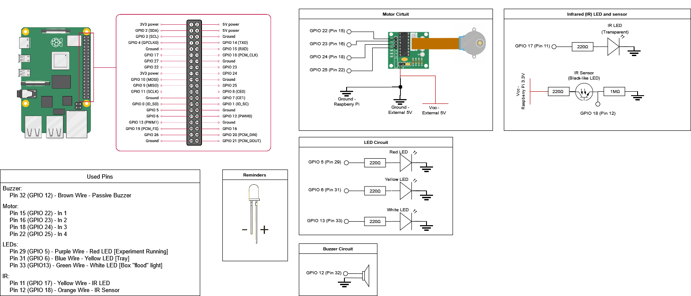
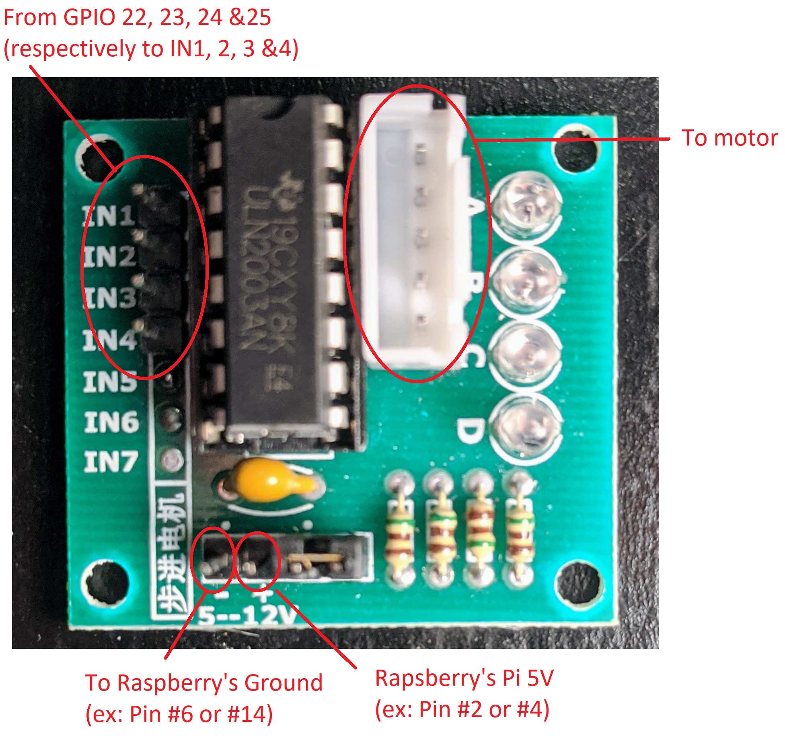
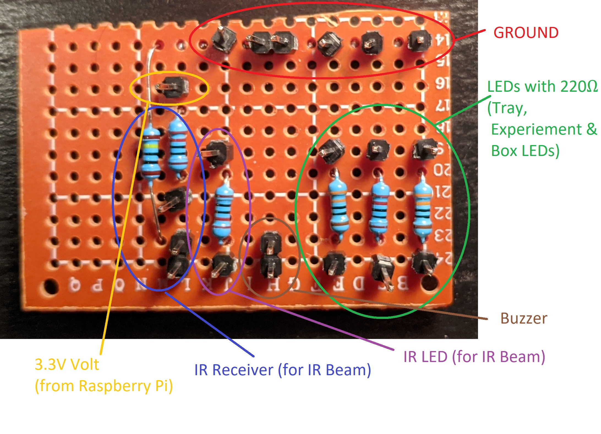
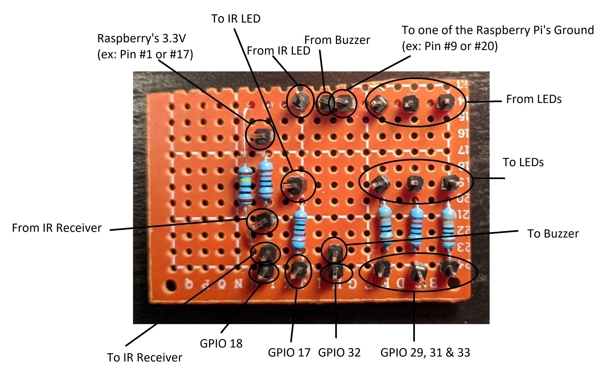

# Hardward Readme
This readme covers the hardware installation and connections.

## Overview
The hardware is composed of the components described below. A schematics is available below.
- **LEDs**: All LEDs are the generic 5mm, ≈15mA LED. They are all in serie with a 220Ω[^1] resistance to limit current to 15mA from the Raspberry Pi 3.3V source. There are three lights in the system:
   - Tray light: LED near the food tray delivery system that turns on when food is available to give a visual indicator to the mouse. Yellow-colored LED.
   - Experiment light: LED on the outside of the experiment box that turns on as a visual indicator that an experiment is currently ongoing. Red-colored LED.
   - Box light: LED on the top of the experiment box that act as a flood light. As of April 2022, this is currently unused in the code or experiment, but could be used when doing maintenance, during a cognitive task, etc. White-colored LED.
- **Motor**: A motor is used to push a syringe that provides liquid-based reward (ex: sugar & water), to the mouse during the experiment. The motor is generally activated when a good answer is given during a congitive task. The motor is a basic 28BYJ-48 stepper motor using 5V DC voltage. It can be run from the 5V output of the Raspberry Pi directly for our application of pushing slighly on a syring. Otherwise, a 2nd 5V source should be used.
- **Buzzer**: A passive piezoeletric buzzer that can be driven by a 3.3V pulse-width modulated (PWM) signal is used to play a sound (default at 3kHz). Generally, in experiments, a sound is played when the food is delivered as an audible indicator.
- **Infrared Beam (IRB)**: An 5mm infrared (IR) LED using a wavelength of 940nm is placed in front of a matched receiver. The LED is in serie with a 220Ω resistance to limit current to 15mA, similarly to visible light LED. The receiver is in serie with a 220Ω resistance to limit current and a pull-down resistor of 1MΩ is used in the system. Currently, we are using Gikfun EK8443 LED (clear LED head) & Receivers (dark LED head) combo[^2]. Note that infrared is used during experiments to detect when the mouse is reaching for the food inside the delivery hole. Infrared is used to prevent any interaction with other lighting indicators (such as the tray light). _Tip:_ Cameras from cell phone can capture light from a 940nm wavelength source. When the LED is powered, you can use a cellphone camera to see if the LED is working properly. You'll see a faint purple glow from the LED through your cellphone camera (easier to see in dark environment).

Overview of the connections & Schematics:

### Boards
You will find three boards in the this setting. The biggest one, is the Raspberry Pi, the computer of the whole setup (see image above). The smallest professional one is a board used to drive the step motor (see image below).

The last board is homemade and capture all of the electronic setup in the of the connections & Schematics. You only have to plug the board as specified in the schematic above (and in the images below) to connect all the hardware appropriately. All the connections are flowing from GPIO to Ground, making it easy to isolate the circuit for each (each LED, buzzer, etc.)

## LEDs
5mm, 15mA "common" LEDs.
- Tray light: Pin 31 (GPIO 6). Driven directly by the GPIO pin. Yellow.
- Experiment light: Pin 29 (GPIO 5). Driven directly by the GPIO pin. Red.
- Box "flood" light: Pin 33 (GPIO 13). Driven directly by the GPIO pin. White.

## Motor
Driven by 5V (5V from Raspeberry is ok for low torque applications)
- Line 1: Pin 15 (GPIO 22)
- Line 2: Pin 16 (GPIO 23)
- Line 3: Pin 18 (GPIO 24)
- Line 4: Pin 22 (GPIO 25)

## Buzzer
Passive piezoelectric, driven directly by the GPIO pin.
- Pin 32 (GPIO 12)

## Infrared Beam
LED is driven directly by the GPIO pin. Receiver's collector is connected to the Raspberry 3.3v. Emitter is connected to the pull-down resistor and the GPIO pin.
- Pin 11 (GPIO 17)
- Pin 12 (GPIO 18)

## Schematics
The schematics image above (available as HTML here https://github.com/oliviabharvey/hackathon/blob/master/hardware/hardware_diagram.html) can be loaded and modified using https://app.diagrams.net/.

[^1]: We were lacking some 220Ω when soldering the boards. 330Ω resistances were used as a replacement.
[^2]: Any IR LED/Receiver that can be driven by 3.3V would work. Just make sure that the receiver is a IR receiver that is at its high voltage state when being illumitated by the IR LED and its low voltage state when the infrared beam is broken.
